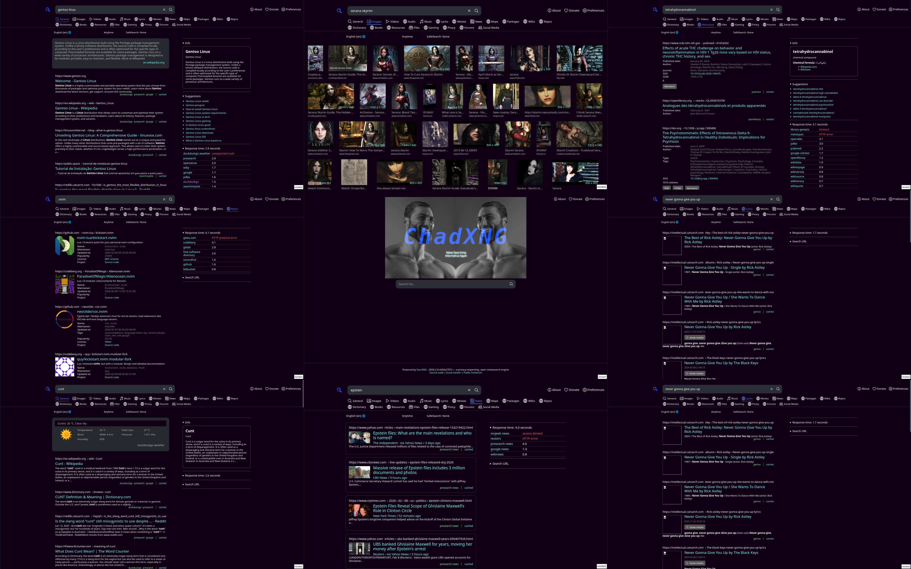

# ChadXNG

A custom SearXNG config that:

- Runs in docker
- Currently only for local use only with http, I'm extremely shit at networking stuff hence no public config or HTTPS
  shenanigans yet.
- BANS GENERATIVE AI DOMAINS!!!!  If you don't like it don't use this. If you want AI SLOP then fork this
- Uses privacy-friendly frontends if it's feasible and mostly usable
- Currently doesn't run over VPN/Tor, so your IP will be leaked to the services it will try to use, I didn't create this
  with privacy in mind (subject to change), I created this because custom search engines is probably the only way to get
  good results without AI SLOP nowadays

# Notes people may wanna know:

### Link replacing:

| site | replaced by |
| --- | --- |
| Reddit | redlib.catsarch.com |
| Twitter | nitter.net |
| Genius | intellectual.catsarch.com |

# Domains:

### blacklists:
- Deepwiki 
- Grokipedia
- All `.ai` domains (sorry Anguilla)
- nixos.wiki (official wiki.nixos.org exists)
- elderscrolls.fandom.com (UESP better and fuck fandom)
- fallout.fandom.com (fallout.wiki better and fuck fandom)
- minecraft.fandom.com (minecraft.wiki better and fuck fandom)

### high priority:

- Wikipedia

For more info on how stuff is handled, just check out the settings.yml file 

# How to Setup:

- copy .env.example file to .env
- change SEARXNG_SECRET, original README suggested using the string generated from the `openssl rand -hex 32` command
- run the docker compose

